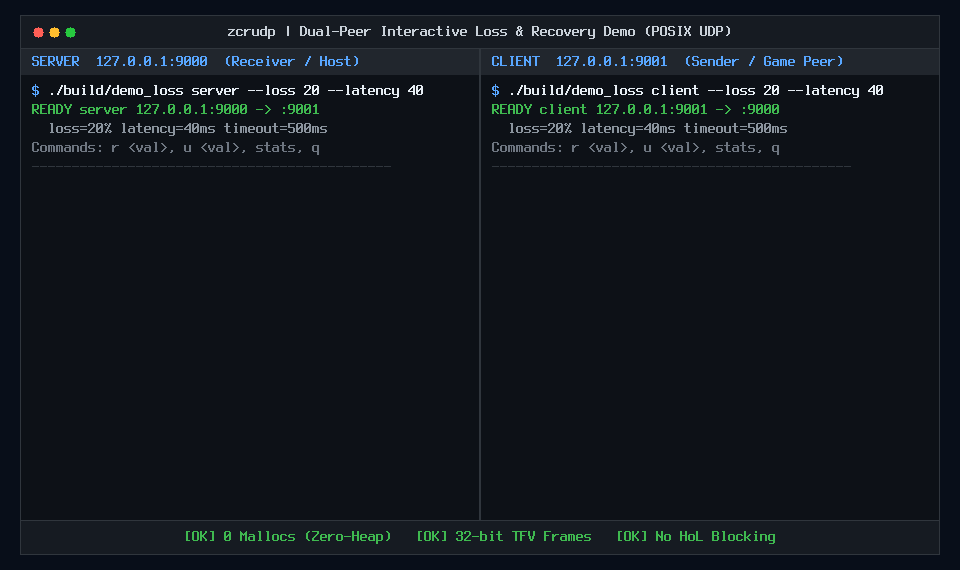
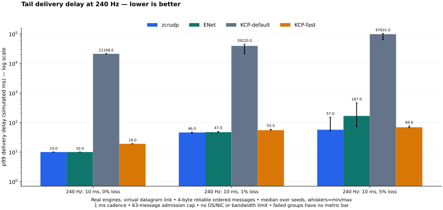
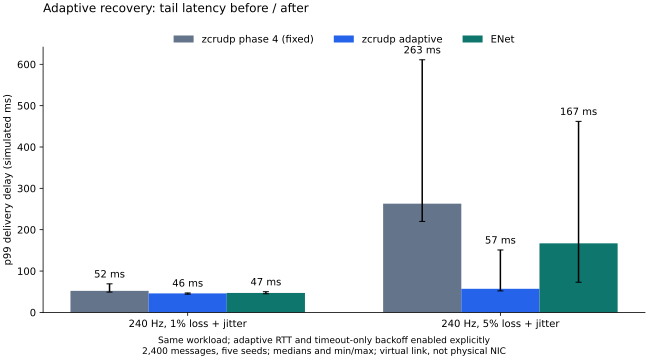

# zcrudp

A zero-malloc, 32-bit fixed-frame Reliable UDP library in pure C.
zcrudp is a C11 library for reliable and unreliable UDP messaging, intended for
small game updates and embedded telemetry. It uses caller-owned buffers, with no
heap allocation or external dependencies. The application provides the clock,
socket and event loop.

## Description


`zcrudp` is a lightweight, high-performance Reliable UDP (RUDP) implementation designed for embedded systems and performance-critical applications. It operates with zero dynamic memory allocation, using a fixed-frame 32-bit structure for both headers and data.
The replay shows the library handling scripted loss and reordering, slowed down
about 30×. Blue packets are reliable; amber marks retries and buffered messages;
green packets are unreliable updates. This is a behavior demo, not a benchmark.
[Interactive replay (download and open locally)](docs/visual/index.html) ·
[Static overview](docs/visual/poster.png) · [Trace and reproduction](docs/visual/README.md)

## Key Features
**Try it in two terminals:**

```bash
make demo
./build/demo_loss server --loss 20 --latency 40
# In another terminal:
./build/demo_loss client --loss 20 --latency 40
```

Type `r 1234` for a reliable event, `u 5678` for a fresh update, or `stats` to see
loss and recovery. [Demo options](#interactive-loss-and-latency-demo) ·
[Measure it yourself](#codec-benchmarks) · [Compare throughput and latency](#transport-benchmarks-vs-enet-and-kcp)

## Memory and wire format

- **1,040 bytes per context; 5,620 bytes per four-channel session** on the measured
  host ABI with default settings. Run `make test` to inspect sizes on your target.
  Each default TX ring has 64 slots and holds 63 outstanding reliable messages.
  Sessions now retain out-of-order reliable payloads in a fixed RX window.
- **4-byte ACK; 12-byte single-update datagram; 132 bytes for 16 data records.**
  These are UDP payload sizes, excluding UDP/IP and link-layer overhead.
- **No heap calls, background threads or socket API in the core.** Integrate
  `src/rudp.c` and the two headers; call the protocol from your own loop.
- **Optional phase-4 profiles:** bounded multipart messages, priority scheduling,
  compact4/rolling8 scalar telemetry and adaptive duplication. Add `src/profiles.c`
  when needed. [Wire formats, API contracts and tradeoffs](docs/PHASE4.md).

## Transport benchmarks vs ENet and KCP

The comparative runner executes zcrudp, ENet and KCP (default and fast profiles):
2,400 reliable ordered
four-byte messages, six scenarios, five seeds — **120 recorded runs**.




These are **virtual-link transport measurements**: common delay/loss/jitter and
1 ms service cadence, not physical-NIC benchmarks. The no-loss saturation cases
show zcrudp matching ENet's goodput at the common 63-message admission limit.
zcrudp emits fewer UDP-payload bytes in this tiny-message workload.

With adaptive recovery enabled, the median of the five per-run p99 values at
5% loss is 57 ms, compared with 263 ms for fixed-timeout zcrudp and 167 ms for
ENet. It costs 352 B of session state and about 9% more UDP-payload traffic than
the fixed-timeout baseline (about 24% less than ENet in this workload).
These results depend on the workload and transport settings, including KCP's
selected profile. See [recovery settings and tradeoffs](docs/ADAPTIVE_RECOVERY.md).



[p50 latency](docs/bench/comparison/latency-p50.svg) ·
[Datagram traffic](docs/bench/comparison/wire-cost.svg) ·
[Host execution cost](docs/bench/comparison/host-cost.svg) ·
[Raw CSV](docs/bench/comparison/results.csv) ·
[Methodology and exact settings](docs/bench/comparison/README.md)

The earlier [RX-buffering regression results](docs/bench/before-phase4/README.md)
are preserved separately, including failed runs.

```bash
make compare COMPARE_PYTHON='uv run --with matplotlib==3.11.1 python'
make test-compare  # Small deterministic comparisons; no plotting package needed
```

Competitor sources are pinned and checksummed, downloaded only for this optional
target. The core still has no external dependency. Already have Matplotlib?
Run `make compare` directly with Python 3.12+.

## CMake integration

The Makefile remains available. CMake 3.21+ can build static (default) or shared
libraries, with no downloaded dependencies:

```bash
cmake -S . -B build/cmake -DCMAKE_BUILD_TYPE=Release -DZCRUDP_BUILD_TOOLS=ON
cmake --build build/cmake --parallel
ctest --test-dir build/cmake --output-on-failure
# Optional: cmake --install build/cmake --prefix /your/install/prefix
```

Embed with `add_subdirectory(path/to/zcrudp)` and link `zcrudp::core` or
`zcrudp::profiles`. Installed packages support `find_package(zcrudp CONFIG REQUIRED)`
with the same target names. Profiles link the core transitively. Tests default
to off when embedded; tools are always opt-in and currently require POSIX.

Options: `BUILD_SHARED_LIBS`, `ZCRUDP_BUILD_PROFILES`, `ZCRUDP_BUILD_TESTS`,
`ZCRUDP_BUILD_TOOLS`, `ZCRUDP_WARNINGS_AS_ERRORS`. ABI settings
`ZCRUDP_WINDOW_SIZE` (default 64) and `ZCRUDP_MAX_CHANNELS` (default 4) propagate
to consumers through targets; do not override their corresponding C macros
independently. Non-default ABIs run the generic window tests, not the existing
default-specific suite. Assertions remain enabled in Release tests.

`make test-cmake` verifies installation/relocation, embedding and configuration.
Linux static/shared builds are tested; this does not certify every compiler or
game engine. Packaging follows CMake's
[import/export model](https://cmake.org/cmake/help/latest/guide/importing-exporting/index.html).

## Protocol features

- **Zero-malloc**: All memory is managed through static or stack-allocated contexts.
- **Fixed-frame RUDP**: Optimized for 32-bit architectures with a total frame size of 8 bytes (4-byte header + 4-byte payload).
- **Explicit wire format**: Unified datagrams use a 4-byte envelope and 8-byte records (channel, flags, sequence, TFV). The legacy single-context frame is 8 bytes total.
- **Cumulative ACKs**: Implements a sliding window (default 64 slots) with cumulative acknowledgment logic.
- **Retransmission**: Built-in timeout handling and retransmission tracking.
- **TFV Integration**: Uses a 32-bit Type-Flags-Value (TFV) structure for the payload.
- **Sequence Rollover**: Robust handling of 16-bit sequence number wraparound.

## Project Structure

```text
.
├── include/
│   ├── protocol_rudp.h    # Core RUDP definitions and context
│   └── protocol_tfv.h     # 32-bit TFV packet structure
├── src/
│   └── rudp.c             # RUDP implementation logic
├── examples/demo_loss.c  # Interactive POSIX UDP peers with simulated loss/delay
├── bench/bench_rudp.c    # In-memory codec benchmarks and CSV/SVG reports
├── docs/bench/           # Recorded benchmark results
└── tests/
    ├── test_rudp.c        # RUDP engine and extreme case tests
    └── test_tfv.c         # TFV structure validation
```

## Quick Start / Usage

### Basic Initialization and Sending

```c
#include "protocol_rudp.h"

rudp_context_s ctx;
rudp_init(&ctx);

tfv_packet_u packet;
packet.type = 1;
packet.flags = 0;
packet.value = 123;

// Send a packet at current timestamp (1000ms)
rudp_send(&ctx, packet, 1000);
```

### Handling ACKs and Retransmissions

```c
// Receive an ACK under N+1 convention: ACK=1 acknowledges packet 0
rudp_recv_ack(&ctx, 1);

// Check for timed-out packets (100ms timeout)
uint16_t expired_slots[64];
rudp_tick_result_s res = rudp_tick(&ctx, 1200, 100, expired_slots, 64);

if (res.status == RUDP_OK && res.count > 0) {
    for (int i = 0; i < res.count; i++) {
        const rudp_frame_s *frame = rudp_get_slot_frame(&ctx, expired_slots[i]);
        // Resend frame via sendto()
    }
}
```

## Building & Testing

The project includes a `Makefile` for compilation, strict C11 compliance, and sanitizers.

### Run all tests
```bash
make test
```

### Run Memory & Undefined Behavior Sanitizers (ASan & UBSan)
```bash
make asan
```

### Build individual tests
```bash
make test_rudp
make test_tfv
make test_window
```

### Manual compilation (alternative)
If you don't have `make`, you can compile manually (ensure the `build/` directory exists):
```bash
mkdir -p build
gcc -Iinclude -Wall -Wextra -O2 src/rudp.c tests/test_rudp.c -o build/test_rudp
./build/test_rudp
```

## Interactive loss and latency demo

Build with `make demo`. This host example uses POSIX IPv4 UDP sockets and
`CLOCK_MONOTONIC` (Linux/macOS); the core library still has no OS dependency.
Open two terminals and start the server first:

```bash
# Terminal 1: listens on 127.0.0.1:9000, sends to port 9001
./build/demo_loss server --loss 20 --latency 40 --jitter 20 --seed 1

# Terminal 2: listens on 127.0.0.1:9001, sends to port 9000
./build/demo_loss client --loss 20 --latency 40 --jitter 20 --seed 2
```

Either terminal accepts these commands:

```text
r 1234    # Send a reliable, ordered value on channel 0
u 5678    # Send an unreliable, sequenced value on channel 1
stats     # Show drops, retries, deliveries and outstanding reliable messages
q         # Exit (Ctrl-C also works)
```

Enter just the command and value, without the explanatory comment. Values are
unsigned 16-bit integers. Reliable retransmissions should eventually deliver
each value once, in order, provided the retry limit is not reached. Unreliable
values can be lost; duplicates and older sequences are discarded.

For an automatic run, keep the server above running and start:

```bash
./build/demo_loss client --count 20 --interval 100 --duration 8000 \
  --loss 20 --latency 40 --jitter 20 --seed 2
```

This sends 20 values **on each channel**. `--duration` is a hard deadline in ms;
allow time for retries after generation finishes. Exit statistics include reliable
messages still pending and delayed datagrams abandoned on exit. EOF on stdin
leaves the network loop running, allowing redirection from `/dev/null`.

Loss is an independent integer percentage applied to every outgoing datagram,
including ACKs and retransmissions. Each surviving datagram waits `--latency`
plus a uniform integer delay from zero through `--jitter` ms in a fixed 512-slot
queue. Queue saturation is reported separately. Both peers apply their own
settings, so injected round-trip delay is the sum of the two directions. The
5 ms event-loop polling interval adds scheduling granularity. A seed fixes the
PRNG stream; OS scheduling and retransmissions can still change the full trace.

`--timeout` defaults to 500 ms and starts when the reliable message is queued,
before injected delay. Set it above the expected round-trip delay to avoid
premature retries. Retries use `rudp_tick()` and the library retry limit; exceeding
that limit exits with a nonzero status. The example serializes only new or
expired reliable slots, so ACK emission does not retransmit the whole window.

Use `--bind`, `--peer`, `--port` and `--peer-port` for two machines or alternative
ports. Addresses must be numeric IPv4. The peer address is configured explicitly;
there is no discovery, handshake, encryption or peer authentication in this demo.
Run `./build/demo_loss --help` for all options.

## Codec benchmarks

```bash
make bench                              # Run seven batches per codec
make bench BENCH_ITERATIONS=10000000    # Longer batches
make bench-report                       # Regenerate docs/bench CSV, SVG and log
```

The executable also supports independent output paths:

```bash
./build/bench_rudp --iterations 1000000 --csv build/codec.csv --svg build/codec.svg
```

The suite measures legacy 8-byte frame encoding/decoding, unified 8-byte record
encoding/decoding, and decoding a complete 132-byte datagram containing 16 records.
Each case warms up for 10,000 operations, then reports the median, minimum and
maximum batch-average cost across seven samples. Inputs vary; outputs contribute
to an observable checksum. The benchmark builds without LTO to keep codec calls
in the timed loop. No socket calls or explicit allocations occur in that loop.

**ns/op is amortized CPU-side elapsed time, not individual-call tail latency or
network latency.** It includes loop/checksum overhead. Mops/s equals `1000 / ns/op`;
for the single-frame/record cases this is Mpps of codec processing, not achievable
UDP packet rate. The final row counts whole datagrams per operation; its CSV also
reports the corresponding record throughput. Encoding and decoding are measured
separately, with hot data, and not as an end-to-end transport workload.


The checked-in example was measured on an Intel Core Ultra 9 288V, x86-64 WSL2,
with GCC 13.3.0, `-O2` and `-fno-lto`, using 1,000,000 operations per batch.
See the [raw CSV](docs/bench/codec.csv) and [environment/run log](docs/bench/environment.txt).
These host-specific observations are not performance guarantees for STM32 or
other targets. CPU frequency, background load, compiler and virtualization affect
the results. Regenerate on the target host before comparing changes; use the same
build flags and batch size. Short runs are useful for smoke tests only.


### Host-tool integration tests

```bash
make test-tools
```

Requires Python 3 (standard library only) and permission to open loopback UDP
sockets. Tests cover CLI validation, two real peers, interactive commands,
reliable recovery under simulated loss/jitter, unreliable ordering, total loss,
and CSV/SVG report validity. This target does not enforce timing-based performance
thresholds and is separate from the portable core tests.

## Comparison with Other Libraries
## How it compares

| Feature | `zcrudp` | `ENet` | `KCP` | `Valve GNS` | `QUIC (RFC 9000)` |
| :--- | :--- | :--- | :--- | :--- | :--- |
| **Allocation Model** | **Strict Zero-Malloc** | Dynamic (`malloc`) | Custom Hook / Heap | Object Pools / Heap | Dynamic Heap |
| **Connection Footprint** | **1,036 B** (ctx) / **4,196 B** (4 ch) | ~20 - 64 KB | ~8 - 32 KB | > 100 KB | > 150 KB |
| **Bare-Metal MCU Ready** | **Yes** (STM32, ESP32, lwIP) | No (OS-tied) | With static pool | No | No |
| **Wire Header Size** | **4 B** (ack) / **8 B** (frame) | 28 - 48 B | 24 B | 15 - 40+ B | 20 - 50+ B |
| **Multi-Channel Multiplexing**| **Native (4 isolated channels)** | Native | Manual (1 cb/stream)| Native (Multi-lane) | Native (Streams) |
| **Head-of-Line Blocking** | **None** (per-channel isolated) | Partial | High (single stream)| None | None |
| **Intra-Tick Multi-ACK Bundling**| **Yes** (`build_datagram`) | Piggybacked | Piggybacked | Batched frames | SACK frames |
| **Encode Speed (Single Core)**| **~2.0 ns / op** (~500 Mops/s) | ~120 - 250 ns | ~45 - 80 ns | ~300 - 800 ns | Complex AEAD |
| **Distributed AI KV-Cache** | **Engineered (Prefill-Decode)**| Unsuitable | Unsuitable | Average | Average (HTTP/3) |
For a single four-byte message, the unified zcrudp datagram occupies **12 bytes
of UDP payload**, compared with **28 bytes for a KCP PUSH segment**: 57% fewer
bytes at this layer in that specific case. ENet's reliable encoding is already
close, at 12–14 bytes under the stated assumptions. These are calculations from
wire definitions, not throughput measurements. See the
[sourced layouts and assumptions](docs/COMPARISON.md#small-message-wire-comparison).

For complete technical benchmarks, packet layouts, and architectural analysis, see [docs/COMPARISON.md](docs/COMPARISON.md).
The strongest reason to choose zcrudp is its combination of caller-owned fixed
storage, small records and separate reliable/unreliable paths. The current tests
verify that automatic unreliable updates continue when the reliable TX window
fills, that the simulation preserves deadline order, and that sequence gaps
trigger ACKs without wrapping the duplicate-ACK counter.

For general large messages, built-in security or broader networking features,
evaluate ENet, KCP, GNS or QUIC against those needs. The repository now includes
matched virtual-link runs for ENet and KCP. Peak-memory comparisons, physical-network
tests, bulk KV-cache transfer and hardware-validated MCU integration remain open.
The [comparison guide](docs/COMPARISON.md) separates measured transport behavior
from wire-layout calculations and architectural tradeoffs.

## License

This project is licensed under the MIT License - see the [LICENSE](LICENSE) file for details.
