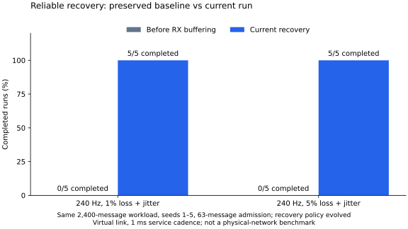

# Preserved baseline: before bounded RX storage

`results.csv` and `environment.json` are the original 120-run artifacts, copied
before phase-4 changes. They retain failed runs; partial delays are not compared
to completed-workload delays. Source/header SHA-256 values identify the baseline
core; the current comparison records its own hashes. The harness is unchanged.
The baseline core and header match commit
`072e0c6a19f8c9abc5da14d2ef06f9f2d6c66bb1` byte for byte (verified by SHA-256).

| zcrudp workload | Before: completed seeds | After: completed seeds |
| --- | ---: | ---: |
| Saturated local / WAN / lossy WAN | 15/15 | 15/15 |
| 240 Hz, no loss | 5/5 | 5/5 |
| 240 Hz, 1% loss + jitter | 0/5 | 5/5 |
| 240 Hz, 5% loss + jitter | 0/5 | 5/5 |

Each run sends 2,400 reliable ordered four-byte messages. The before/after RX
versions in this historical table use
63-message admission, a 64-slot TX ring, 100 ms base timeout, the same retry/backoff
policy and 1 ms service cadence. Competitor revisions/settings are unchanged.
The added RX bitmap/payload storage costs 264 bytes per channel on this ABI.

[Current dataset and latency/traffic tradeoffs](../comparison/README.md).
The completed fixed-timer phase-4 version is now preserved separately in
[`phase4-baseline`](../phase4-baseline/README.md); the current runner enables
adaptive recovery and therefore intentionally changes timer policy.
Rerun with `make compare`; the baseline directory is not overwritten.
The graph intentionally compares completion, not a speedup obtained by dividing
successful latency by a failed run's partial latency.
